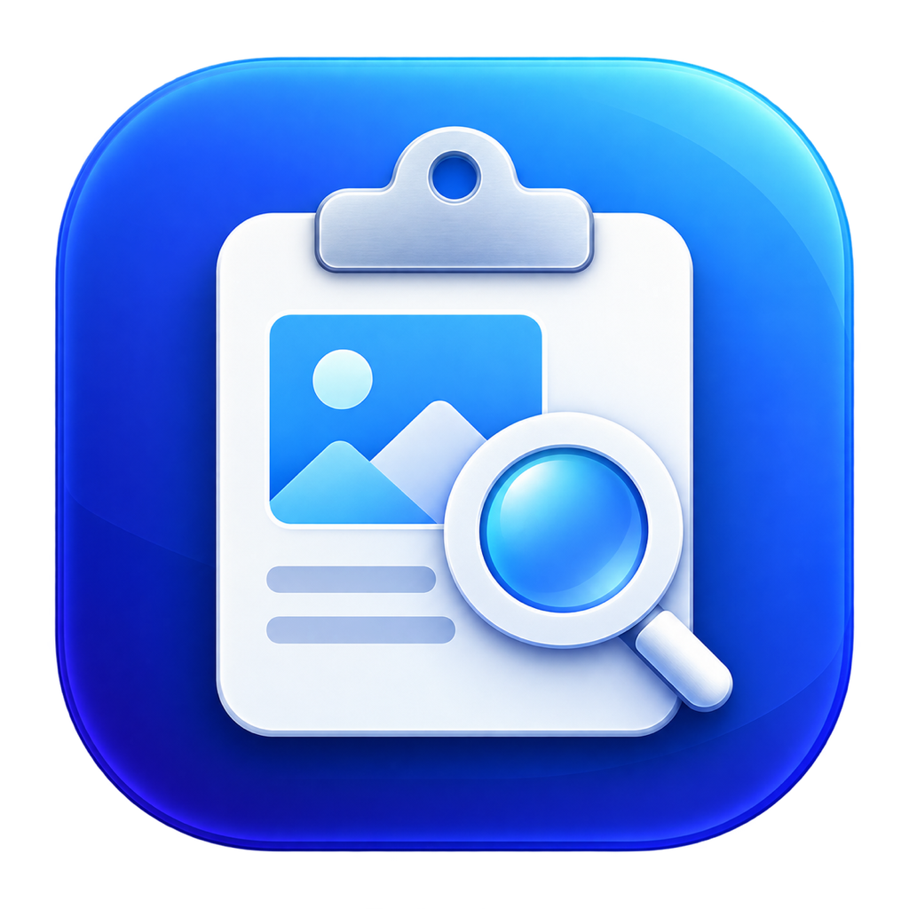
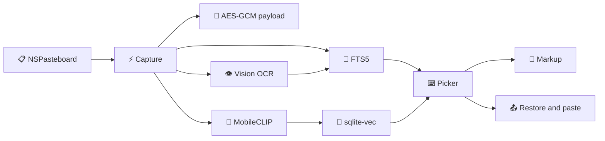

<div align="center">

# 📋 Clipboard Library



### ⚡ Search everything you copied. Find images by meaning. Paste in one keystroke. ⚡

[](https://www.swift.org/)
[](https://www.apple.com/macos/)
[](#-local-semantic-search)
[](#-proof-not-promises)
[](https://github.com/agents-dev/clipboard-library-swift/stargazers)

> **Turn the macOS clipboard into a private, searchable library.**  
> **Keep rich formats. Read text inside images. Add markup. Keep every operation on your Mac.**

```text
╔══════════════════════════════════════════════════════╗
║  COPY  →  ENCRYPT  →  INDEX  →  SEARCH  →  PASTE  ║
╚══════════════════════════════════════════════════════╝
        Y O U R   C L I P B O A R D   R E M E M B E R S
```

</div>

---

## 🧠 TL;DR

Open Clipboard Library from the Dock or press **Command-Shift-V**. Search text, URLs, rich content, OCR results, and images. Select one result. Press Return. Clipboard Library restores the original pasteboard representations and pastes them into the application that you were using.

Yes, it searches image text. Yes, it searches image meaning. Yes, it runs locally.

## 🤯 What does it solve?

Standard clipboard history usually loses context, rich formats, or image meaning. Clipboard Library captures each pasteboard item with its Uniform Type Identifier representations, encrypts the raw payload, and builds two local search indexes.

Use exact full-text search when you remember the words. Use semantic search when you remember only the idea.

## 🌍 What can you do?

| | Capability | Result |
|---|---|---|
| 🔎 | **Exact search** | Find words, prefixes, OCR text, tags, source applications, and content types. |
| 🧠 | **Semantic search** | Find related text and images with local MobileCLIP embeddings. |
| 🖼️ | **Image OCR** | Extract visible text with Apple Vision. |
| 🎨 | **Image markup** | Draw, highlight, add shapes, add text, crop, blur, and redact. |
| 🗂️ | **Raw format capture** | Preserve plain text, HTML, RTF, images, file URLs, and custom types. |
| ⌨️ | **Fast picker** | Open the floating picker with a configurable global shortcut. |
| 📌 | **Pins and tags** | Keep important items near the top and add searchable labels. |
| 🔐 | **Encrypted payloads** | Protect raw clipboard data with AES-GCM and a Keychain key. |
| 🚫 | **Application exclusions** | Stop capture from selected bundle identifiers. |
| 📴 | **Offline operation** | Run storage, OCR, and model inference without a network service. |

## ⚡ Quick start

Require macOS 15 or later, Apple Silicon, Xcode, and the Swift 6 toolchain.

```bash
# 🚀 Build and test the source
git clone https://github.com/agents-dev/clipboard-library-swift.git
cd clipboard-library-macos
swift test

# 📦 Create an ad-hoc signed internal app
bash scripts/build-app.sh
open "outputs/Clipboard Library.app"
```

Copy an item. Press **Command-Shift-V**. Start typing. Press Return to paste.

Enable macOS Accessibility access when the app requests it. If access is off, Clipboard Library copies the selected result and asks you to press Command-V manually.

## ✨ Core workflow



## 🧠 Local semantic search

Bundle the Apple MobileCLIP-S0 text and image encoders as compiled Core ML models. Normalize 512-dimensional vectors. Store them in statically linked `sqlite-vec` tables. Combine semantic results with SQLite FTS5 results.

Run OCR and embeddings on a serial background queue. Display new captures immediately with an **Indexing** state. Resume unfinished indexing after restart.

## 🎨 Non-destructive image markup

Keep the source image immutable. Store markup commands as Codable layers. Save multiple versions under the original clipboard item.

Use these tools:

- ✏️ Draw with pen and highlighter.
- ➡️ Add arrows, rectangles, and ellipses.
- 🔤 Add text with color and size controls.
- ✂️ Crop exported output.
- 🌫️ Blur selected areas.
- ⬛ Redact selected areas.
- ↩️ Undo and redo edits.
- 📤 Copy or export a rendered PNG.

## 🏗️ Project map

```text
📦 clipboard-library-macos
├── 📱 Sources/ClipboardLibrary
│   ├── App.swift                 # Menu bar, picker, hotkey, capture, paste
│   ├── Storage.swift             # GRDB, FTS5, encryption, vector tables
│   ├── Semantic.swift            # MobileCLIP inference and tokenizer
│   ├── Markup.swift              # Editable image annotation versions
│   └── Resources                 # Core ML models, tokenizer, model licenses
├── 🎨 Assets                     # App icon master and compiled icon
├── 🧮 Sources/CSQLiteVec         # Statically linked sqlite-vec
├── 🧪 Tests                      # Storage, inference, tamper, scale checks
├── 🔧 scripts                    # Reproducible model and app builds
└── 📖 wiki                       # Architecture notes
```

## 📊 Proof, not promises

Run `swift test` on an Apple Silicon Mac. The current test suite verifies:

- ✅ Text and image Core ML inference.
- ✅ A 100,000-item combined search workload.
- ✅ Raw multi-format payload round trips.
- ✅ Consecutive-copy deduplication.
- ✅ Full-text indexing and search.
- ✅ AES-GCM tamper detection.
- ✅ Payload deletion.

The measured 100,000-item combined search completed in approximately **185 ms** on the development Mac. Treat this number as a local benchmark. Measure your own hardware and data.

## 🔐 Privacy and storage

- Keep all inference on the Mac.
- Store raw pasteboard payloads in AES-GCM encrypted files.
- Store the payload key in macOS Keychain.
- Store previews, OCR text, tags, and search metadata in the local SQLite database without field-level encryption.
- Skip pasteboard content that the source marks as transient or concealed.
- Retain history until you delete it.

## ⚠️ Model license

Use the bundled Apple MobileCLIP model weights only for **research purposes**. The Apple Machine Learning Research Model License excludes commercial product development and commercial use. Read [LICENSE_MODELS](Sources/ClipboardLibrary/Resources/LICENSE_MODELS) before you use or redistribute the weights.

The source code and third-party components retain their respective notices. Do not treat the repository license as a replacement for the model license.

## 🐛 Troubleshooting

| 🧩 Problem | 🛠️ Action |
|---|---|
| The shortcut does not open | Select another shortcut in Settings. Close any application that owns the same shortcut. |
| Automatic paste does not run | Enable Clipboard Library in **System Settings → Privacy & Security → Accessibility**. |
| A new item says Indexing | Keep the app running. Use **Rebuild search index** if indexing was interrupted. |
| An application must stay private | Add its exact bundle identifier to the exclusion list. |
| macOS blocks the internal build | Build the app locally with `bash scripts/build-app.sh`. Sign it with your Developer ID for distribution. |

## 🤝 Contribute

1. Read [AGENTS.md](AGENTS.md).
2. Read [the architecture notes](wiki/architecture.md).
3. Create a focused branch.
4. Make one clear change.
5. Run `swift test`.
6. Open a pull request with the behavior change and test evidence.

## ⭐ Star the repository

If your clipboard should remember more than the last thing you copied, press the star button. ⭐

<div align="center">

**Built with SwiftUI, AppKit, Vision, Core ML, GRDB, CryptoKit, and sqlite-vec.** 🔬

*Your clipboard forgot. This one did not.* 😏

</div>
